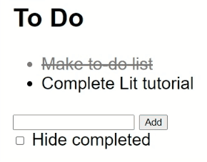

<div align="center">
  <a href="https://Marfullsen.github.io/tutorial-todo-list-using-lit/" rel="noopener">
    
  </a>
</div>

<div align="center">

# Tutorial "To do list" using Lit

[](https://lit.dev/)
[](https://Marfullsen.github.io/tutorial-todo-list-using-lit/)

</div>

<div align="center">
  Learning the ropes and making the first LitElement.
</div>

## ¿De qué trata este _Tutorial_?
En este tutorial se realizará un listado de cosas por hacer, también conocido en inglés como "To do list", el sitio del tutorial está disponible [aquí](https://lit.dev/tutorials/intro-to-lit/)

## ¿Hay alguna demo disponible?
Si, la demo está disponible en [Marfullsen.rocks/tutorial-todo-list-using-lit/](https://Marfullsen.github.io/tutorial-todo-list-using-lit/)

## Instalación del proyecto

Clonar y luego correr con algún servidor http.

```
git clone https://github.com/Marfullsen/tutorial-todo-list-using-lit.git
```

## Capturas de pantalla

<div align="center">
  <a href="https://Marfullsen.github.io/tutorial-todo-list-using-lit/" rel="noopener">
    
  </a>
</div>

## Referencias
- [Tutorial del TODO list en Lit](https://lit.dev/tutorials/intro-to-lit/)
- [load lit-html directly from the JS](https://lit.dev/docs/v1/lit-html/getting-started/)
